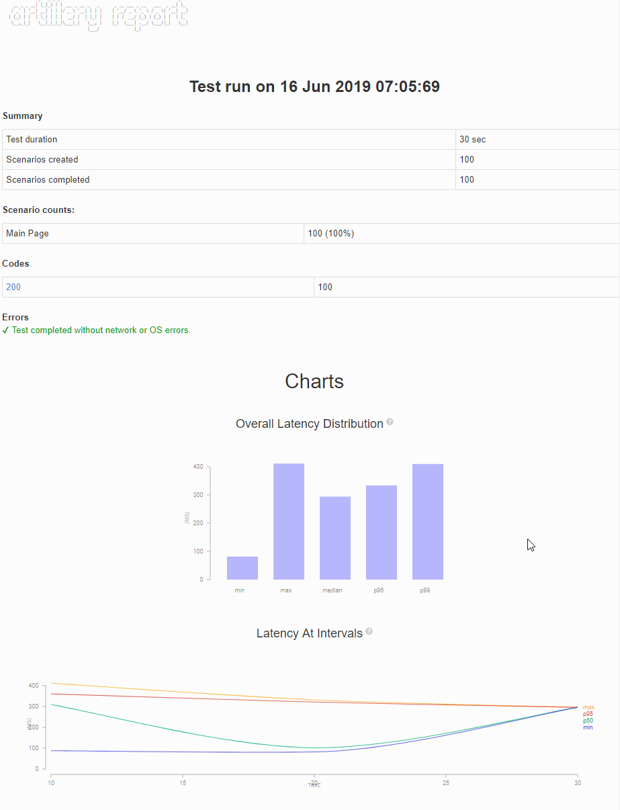

# Pay per Minute Load Tests using Artillery and Azure Container Instances

## Gettin Started

### 1. Create an Artillery load test

``` yaml
config:
 ensure:
   p95: 3000
 environments:
   prod:
     target: 'https://somewebsite.com'
     phases:
     - name: "constant load"
       duration: 20
       arrivalRate: 5
scenarios:
 - name: "Main Page"
   flow:
   - get:
       url: "/"
```

### 2. Create a Dockerfile

``` Dockerfile

FROM fgauna12/gaunastressyou:1.0.0

# Copy load test files into container
COPY samples/load.yml .

```

### 3. Build and Publish Container

``` console
docker build -t "[image name]" . 
docker push
```

### 4. Run Container From Azure

1. Copy the ARM Template here and name it `armdeploy`
https://raw.githubusercontent.com/fgauna12/AzureArtilleryLoadTests/master/armdeploy.json
2. Run the ARM template

#### Bash (Azure CLI)

``` console

az group create -g "[resource group]" -l "[location]"

az group deployment create -g "[resource group]" -n "[load test name]" \
    --template-file azuredeploy.json \
    --parameters loadTestName="[load test name]" \
    -timeStamp=2019-06-16 \
    -artillery-environment "[environment as defined in artillery yml]" \
    -artillery-file load.yml

```

#### Powershell (AZ Module)

``` powershell

param(
    # Location
    [Parameter()]
    [string]
    $Location = "eastus",
    # Environment
    [Parameter(Mandatory = $true)]
    [string]
    $Environment,
    # The name of the load test
    [Parameter(Mandatory = $true)]
    [string]
    $LoadTestName
)

$resourceGroupName = "$Environment-$LoadTestName-loadtest-rg"

Write-Host "Creating resource group"

New-AzResourceGroup -Location $Location -Name $resourceGroupName | Out-Null

Write-Host "Starting load test using Azure Container Instance"

New-AzResourceGroupDeployment `
        -ResourceGroupName "$Environment-$LoadTestName-loadtest-rg" `
        -TemplateFile "armdeploy.json" `
        -Mode Incremental `
        -loadTestName $LoadTestName `
        -timeStamp "$(Get-Date -Format 'yyyyMMddmmss')" `
        -artillery-environment $Environment `
        -artillery-file "load.yml"

```


### 5. Open HTML Results from Blob Storage

Go to the storage account created and navigate down to the blobs. 


You'll see an HTML report created.



